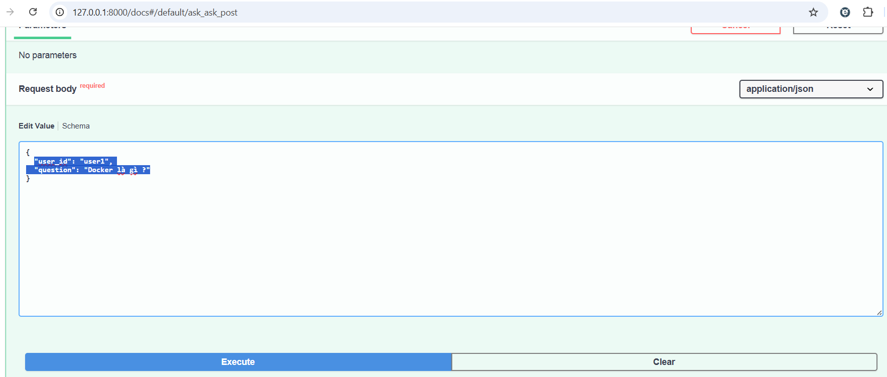
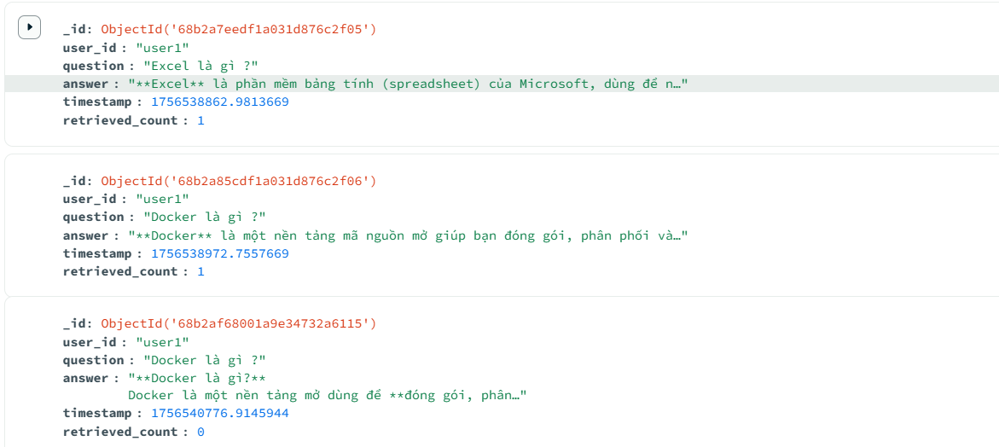

# 🧠 AI Agent Memory với FastAPI + LangChain + Ollama + MongoDB + Chroma

Dự án mẫu triển khai **AI Agent** có khả năng:
- Tiếp nhận câu hỏi của người dùng
- Sử dụng LLM (Ollama / Phi-2 / Llama2…) để suy luận và trả lời
- Ghi nhớ lịch sử hội thoại vào **MongoDB + ChromaDB (vector database)**
- Truy xuất thông tin cũ để trả lời thông minh hơn (Memory Agent)

---

## ⚙️ Kiến trúc hệ thống

ai-agent-memory/
├── app/
│ ├── main.py # FastAPI entrypoint
│ ├── agent.py # LangChain agent setup
│ ├── db.py # MongoDB + Chroma init
│ ├── memory.py # Vector search + lưu embedding
│ └── models.py # Pydantic models
├── .env # Cấu hình ENV
├── requirements.txt # Thư viện Python
└── README.md # Tài liệu hướng dẫn

---

## 🚀 Công nghệ sử dụng
- [FastAPI](https://fastapi.tiangolo.com/) → xây REST API
- [LangChain](https://www.langchain.com/) → AI Agent framework
- [Ollama](https://ollama.ai/) → chạy LLM offline (phi-2, llama2, mistral…)
- [ChromaDB](https://www.trychroma.com/) → lưu trữ vector embedding
- [MongoDB](https://www.mongodb.com/) → lưu metadata, user history
- [SentenceTransformers](https://www.sbert.net/) → sinh embedding cho text

---

## 🛠️ Cài đặt

### 1. Clone repo
```bash
git clone https://github.com/<your-username>/ai-agent-memory.git
cd ai-agent-memory
```
2. Tạo môi trường ảo
```bash
python -m venv venv
source venv/bin/activate   # Linux/Mac
venv\Scripts\activate      # Windows
```
3. Cài dependencies
```bash
pip install -r requirements.txt
```
4. Cấu hình .env
MONGO_URI=mongodb://localhost:27017
MONGO_DB=ai_agent
MESSAGES_COLLECTION=messages
CHROMA_DIR=./chroma_store
OLLAMA_URL=http://localhost:11434
OLLAMA_MODEL=gpt-oss:20b
DUPLICATE_SIMILARITY_THRESHOLD=0.88

▶️ Chạy ứng dụng
1. Start MongoDB (local hoặc Docker)
```bash
docker run -d -p 27017:27017 --name mongo mongo
```
2. Start Ollama + pull model
```bash
ollama pull phi
ollama serve
```
3. Start FastAPI
```bash
uvicorn app.main:app --reload
```
Ứng dụng chạy tại: http://127.0.0.1:8000

API docs: http://127.0.0.1:8000/docs
📌 API Usage
POST /ask
Request:

Response:

